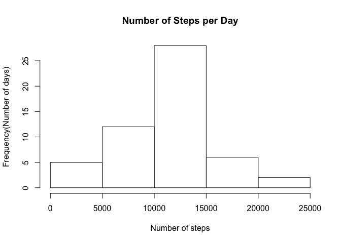
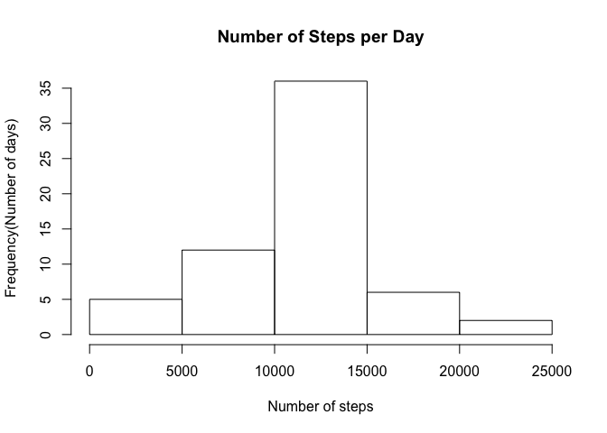
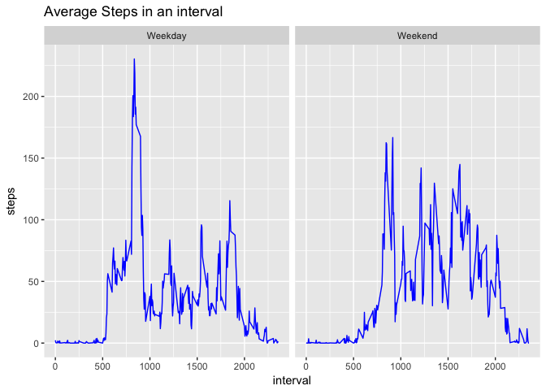

# Reproducible Research: Peer Assessment 1
Abhijeet Kunwar  
10/2/2017  


## Loading and preprocessing the data

```r
fileUrl <- "https://d396qusza40orc.cloudfront.net/repdata/data/activity.zip"
fileName <- "activity.zip"
dataFile <- "activity.csv"
if(!file.exists(fileName))
        download.file(fileUrl, destfile = fileName, method = "curl")
if(!file.exists(dataFile))
        unzip(fileName)

act_data <- read.csv(dataFile, sep = ",", na.strings = "NA")
```

## Histogram of the total number of steps taken each day

```r
library(dplyr)
activity_data <- filter(act_data, !is.na(steps))
steps_per_day <- tapply(activity_data$steps, activity_data$date, FUN=sum)
hist(steps_per_day, xlab = "Number of steps", ylab = "Frequency(Number of days)", main = "Number of Steps per Day")
```

<!-- -->


## Mean and median number of steps taken each day

```r
rmean <- mean(steps_per_day, na.rm = TRUE)
rmedian <- median(steps_per_day, na.rm = TRUE)
```
The mean is 1.0766189\times 10^{4} and median is 10765

## Time series plot of the average number of steps taken

```r
library(ggplot2)
avg_activity_data <- aggregate(activity_data, by = list(activity_data$interval), FUN = mean)
ggplot(avg_activity_data, aes(interval, steps)) + geom_line()
```

<!-- -->

## The 5-minute interval that, on average, contains the maximum number of steps

```r
rint <- head(avg_activity_data[order(avg_activity_data$steps, decreasing = TRUE),], 1)$interval
rint
```

```
## [1] 835
```

## Code to describe and show a strategy for imputing missing data

```r
pruneFn <- function(x) {
        steps <- x[1]
        intval <- x[3]
        if(is.na(steps)) {
                steps = avg_activity_data$steps[match(as.numeric(intval), avg_activity_data$interval)]
        }
        steps
}
pruned_act_data <- act_data
pruned_act_data$steps <- as.numeric(pruned_act_data$steps)
pruned_act_data$steps <- apply(pruned_act_data, 1, FUN = pruneFn)
pruned_steps_per_day <- tapply(as.numeric(pruned_act_data$steps), pruned_act_data$date, FUN=sum)
```

## Histogram of the total number of steps taken each day after missing values are imputed


```r
hist(pruned_steps_per_day, xlab = "Number of steps", ylab = "Frequency(Number of days)", main = "Number of Steps per Day")
```

<!-- -->

## Panel plot comparing the average number of steps taken per 5-minute interval across weekdays and weekends


```r
weekends <- c("Saturday", "Sunday")

assignDayType <- function(x) {
        date <- x[2]
        daytype <- "Weekend"
        if(weekdays(as.Date(date, '%Y-%m-%d')) %in% weekends) {
                daytype <- "Weekend"
        } else {
                daytype <- "Weekday"
        }
        daytype
}
pruned_act_data$daytype <- apply(pruned_act_data, 1, FUN = assignDayType)
pruned_act_data$steps <- as.numeric(pruned_act_data$steps)
pruned_act_data_steps <- aggregate(list(steps=pruned_act_data$steps), by=list(interval=pruned_act_data$interval, daytype=pruned_act_data$daytype), FUN = mean)
ggplot(pruned_act_data_steps, aes(interval, steps)) + geom_line(colour="blue") + facet_grid(.~daytype)+ ggtitle("Average Steps in an interval")
```

<!-- -->
